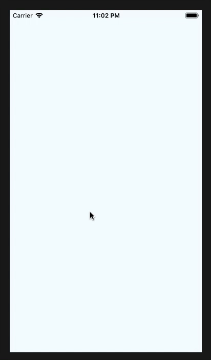

<div align="center">
    
</div>
<h1 align="center">nanokit-toast</h1>
<div align="center">
  <strong>Simple Toast component for React Native/strong>
</div>
<br>
<div align="center">
  <a href="https://npmjs.org/package/nanokit-toast">
    
  </a>
  <a href="https://npmjs.org/package/nanokit-toast">
  
  </a>
  <a href="https://github.com/prettier/prettier">
    
  </a>
    <a href="https://greenkeeper.io/">
    
  </a>
  <a href="https://github.com/tiaanduplessis/nanokit-toast/blob/master/LICENSE">
    
  </a>
  <a href="http://makeapullrequest.com">
    
  </a>
</div>
<br>
<div align="center">
  <a href="https://github.com/tiaanduplessis/nanokit-toast/watchers">
    
  </a>
  <a href="https://github.com/tiaanduplessis/nanokit-toast/stargazers">
    
  </a>
  <a href="https://twitter.com/intent/tweet?text=Check%20out%20nanokit-toast!%20https://github.com/tiaanduplessis/nanokit-toast%20%F0%9F%91%8D">
    
  </a>
</div>
<br>
<div align="center">
  Built with ❤︎ by <a href="https://github.com/tiaanduplessis">tiaanduplessis</a> and <a href="https://github.com/tiaanduplessis/nanokit-toast/contributors">contributors</a>
</div>

<h2>Table of Contents</h2>
<details>
  <summary>Table of Contents</summary>
  <li><a href="#install">Install</a></li>
  <li><a href="#usage">Usage</a></li>
  <li><a href="#contribute">Contribute</a></li>
  <li><a href="#license">License</a></li>
</details>

## Install

```sh
$ npm install nanokit-toast
# OR
$ yarn add nanokit-toast
```

## Usage

```jsx
import React from 'react'
import { View } from 'react-native'
import Toast from 'nanokit-toast'

class Example extends React.Component {

    componentDidMount() {
        setTimeout(() => {
        this.refs.toast.show('At top', 2000, 'top')
        }, 2000)

        setTimeout(() => {
        this.refs.toast.show('At center', 3000, 'center')
        }, 6000)

        setTimeout(() => {
        this.refs.toast.show('At bottom', 2000)
        }, 8000)
    }

    render() {
        return <View style={styles.container}>
        <Toast ref="toast" />
      </View>
    }
}

```

## Contributing

Contributions are welcome!

1. Fork it.
2. Create your feature branch: `git checkout -b my-new-feature`
3. Commit your changes: `git commit -am 'Add some feature'`
4. Push to the branch: `git push origin my-new-feature`
5. Submit a pull request :D

Or open up [a issue](https://github.com/tiaanduplessis/nanokit-toast/issues).

## License

Licensed under the MIT License.